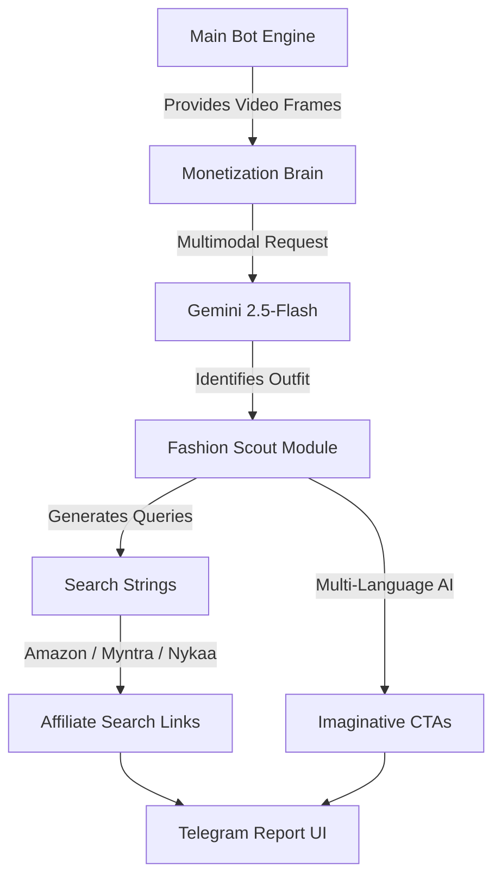
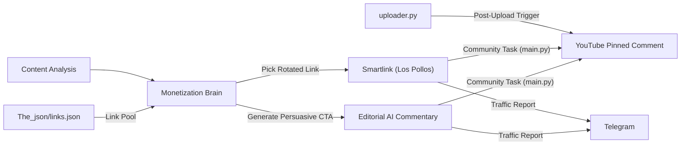
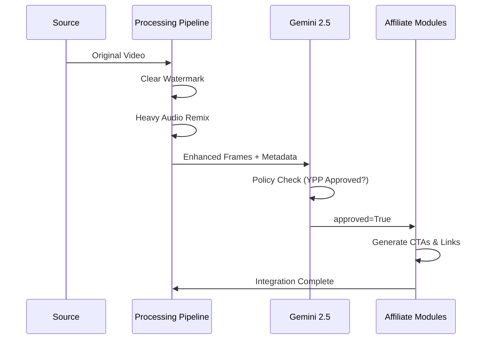
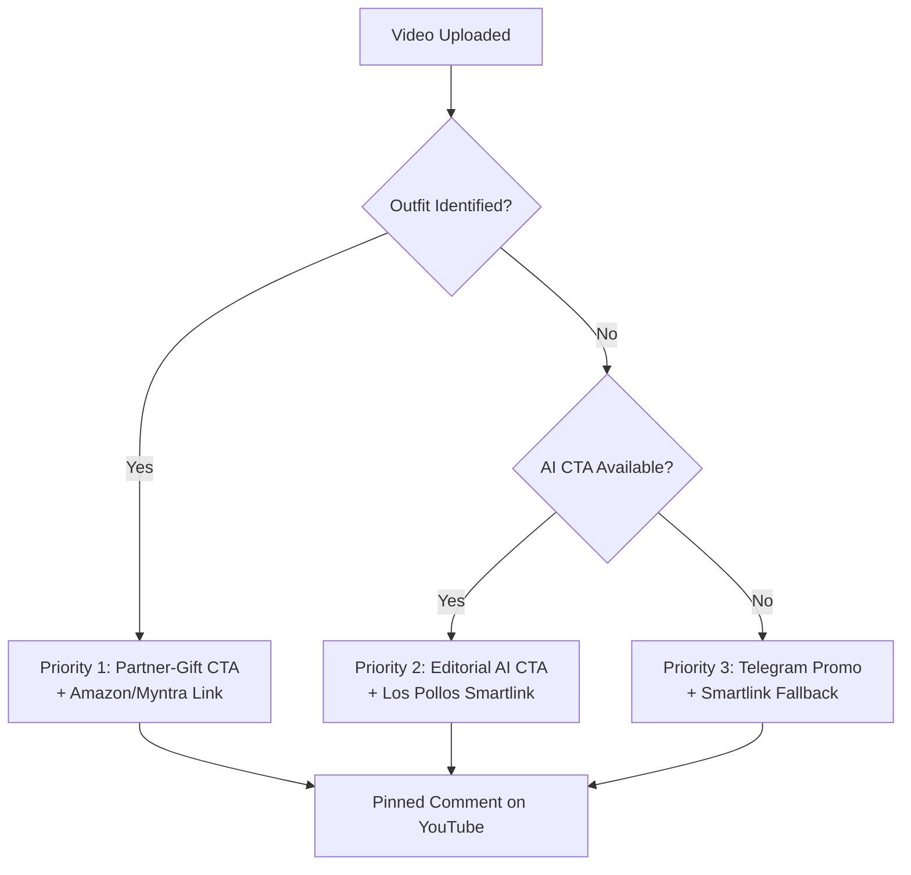

# Affiliate Modules: Visual Operations Guide

This guide provides a graphical representation of how the affiliate and monetization systems flow within the bot.

## 1. Fashion Scout (Amazon / Myntra Affiliate)
This module analyzes celebrity imagery to generate high-intent commerce links.

---

## 2. Los Pollos Integration (Smartlinks)
This module handles traffic monetization via smartlinks and rotated CTAs.

---

## 3. The Transformation Lifecycle
How the bot ensures content is monetizable through transformations.

## 4. Commentary Priority Logic (Pinned Comments)

The bot follows a strict priority for YouTube pinned comments and community posts to maximize monetization quality:

| Priority | Strategy | Source | Description |
| :--- | :--- | :--- | :--- |
| **1 🔥** | **Partner-Gift** | `fashion_scout.py` | If an outfit is found, use a romantic "gift for her" CTA in Hinglish/Urdu/English. |
| **2 🧠** | **Editorial AI** | `monetization_brain.py` | If no outfit, use Gemini's custom editorial commentary for the video. |
| **3 📢** | **Telegram Promo** | `community_promoter.py` | Fallback: Use "Spicy Bait" templates to drive users to the raw Telegram channel. |

### How it Decides (Full Loop):

